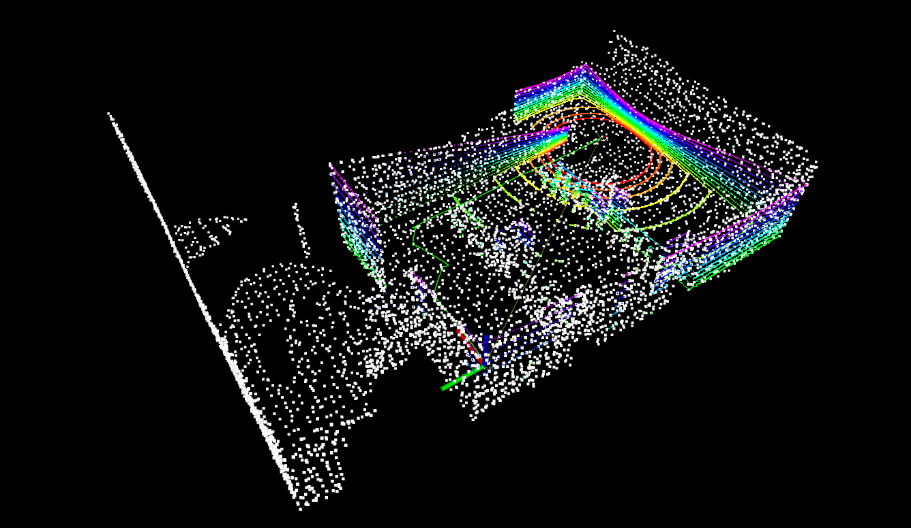
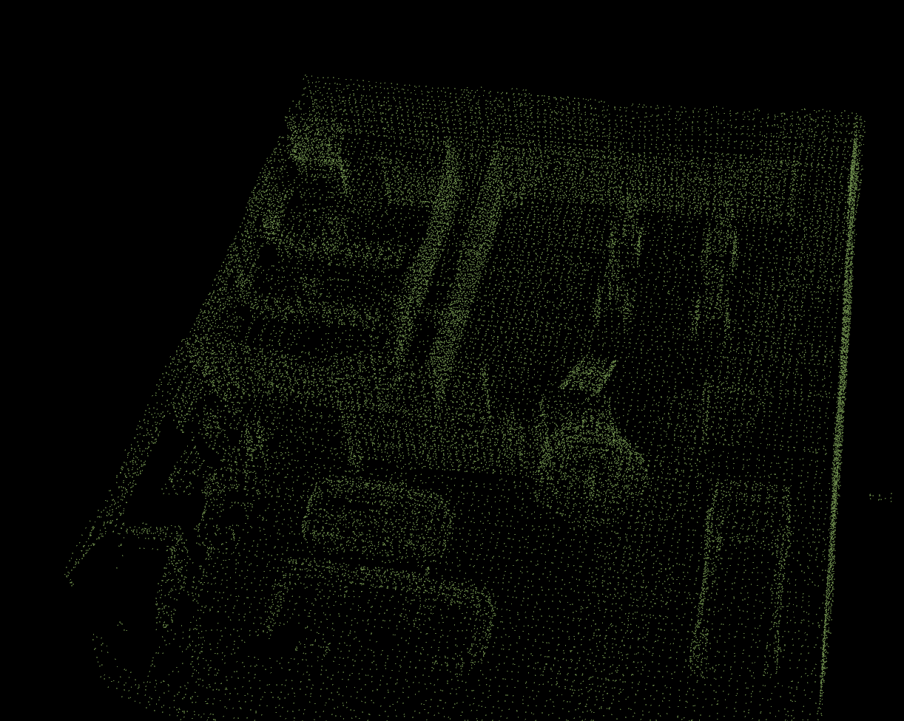
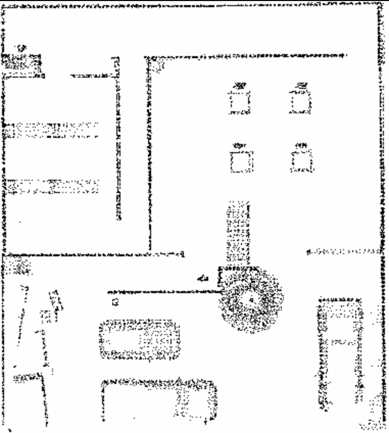
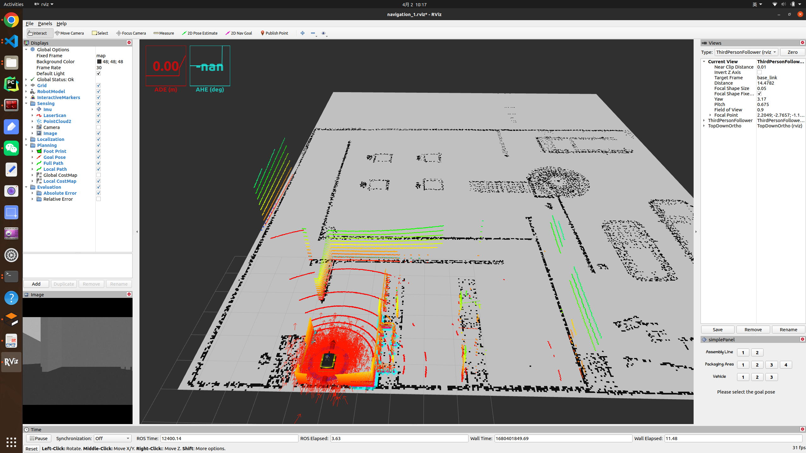
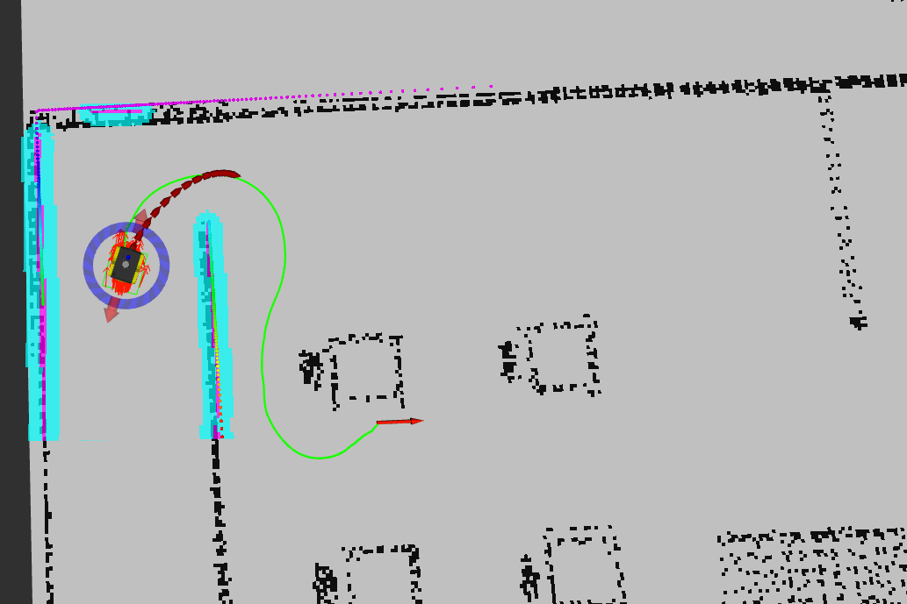

# mobile_final_group12
This repository is the implementation for ME5413 Autonomous Mobile Robotics Final Project
>Created by Group 12


## Dependencies
The requirement can be found in https://github.com/NUS-Advanced-Robotics-Centre/ME5413_Final_Project and also an extra ros package
  * `pcl_ros` is used for generating pcl file from rostopic
## Installation
This repo is a ros workspace, containing several rospkgs:
* `ALOAM` is SLAM algorithm package used for 3D mapping
* `costmap_prohibition_layer` provides a plugin to add virtual obstacle in costmap to set prohibited region
* `interactive_tools` are customized tools to interact with gazebo and your robot
* `jackal_description` contains the modified jackal robot model descriptions
* `jackal_navigation` contains a probabilistic localization system for navigation
* `me5413_world` the main pkg containing the gazebo world, and the launch files
* `pcd2pgm` for converting pcd file to pgm map which can be used for navigation
```bash
# Clone this repo
cd
git clone https://github.com/zzf-zzf/mobile_final_group12.git
cd mobile_final_group12


# Install all dependencies
rosdep install --from-paths src --ignore-src -r -y

# Build
catkin_make
# Source 
source devel/setup.bash
```
To properly load the gazebo world, you will need to have the necessary model files in the `~/.gazebo/models/` directory, which installation instructions can be found in URL above.
## Usage
### 1. Mapping
Following commands will launch the gazebo with the project world
```bash
# Launch Gazebo World together with our robot
roslaunch me5413_world world.launch
```
In the second terminal, launch A-LOAM SLAM for 3D Lidar
```
source devel/setup.bash
roslaunch aloam_velodyne aloam_velodyne_VLP_16.launch 
```
In order to drive the robot around for mapping, launch keyboard control node in the third terminal
```
rosrun teleop_twist_keyboard teleop_twist_keyboard.py 
```
By above you can visualize pointclouds, and finish mapping by exploring all possible areas

To save the pointclouds in a pcl file, run rosnode in `pcl_ros` package to generate file in current direction
```
rosrun pcl_ros pointcloud_to_pcd input:=/laser_cloud_surround
```

To convert the pcl file to pgm format, run rosnode in `pcd2pgm` package after modify the path in `test.cpp`
```
private_nh.param("file_directory", file_directory, std::string("/home/($ your_username)/pcd/")); # the path to pcd file
```
```
private_nh.param("file_name", file_name, std::string("12673.944000000")); # the name of the pcd file
```
Then build the workspace again and run the rosnode
```bash
cd ~/mobile_final_group12
catkin_make
rosrun pcd2pgm pcd2topic
```
And run map saver in another terminal
```
rosrun map_server map_saver
```
After transforming you can obtain the global map by 3D Lidar SLAM like below and also a corresponding .yaml file， rename both as my_map and put them into `src/me5413_world/maps/`


### 2. Navigation
To begin with adding prohibited region in the map, find `prohibition_areas.yaml` in `mobile_final_group12/src/jackal_navigation/params/map_nav_params/` and modify the following content in the file to the desired one
```bash
prohibition_areas:

# define an obstacle point
# - [17.09, -6.388]
 
# define  an obstacle line
 - [[4.5, 1.5],
    [4.5, 5.0]]
 - [[1.0, 1.0],
    [3.0, 1.0]]

# define  an obstacle region
#- [[-11.15, -15.614],
#   [-12.35, -13.89],
#   [-10.05, -12.218]]
```
After that, also check if following lines in `move_base.launch` in `jackal_navigation` package,
```
<rosparam file="$(find jackal_navigation)/params/map_nav_params/prohibition_areas.yaml" command="load" ns="global_costmap/costmap_prohibition_layer" />
<rosparam file="$(find jackal_navigation)/params/map_nav_params/prohibition_areas.yaml" command="load" ns="local_costmap/costmap_prohibition_layer" />
```
Then, add follow code to `global_costmap_params.yaml`:
```
plugins:
- {name: static_layer, type: "costmap_2d::StaticLayer"}
# - {name: obstacles_layer, type: "costmap_2d::ObstacleLayer"}
- {name: inflater_layer, type: "costmap_2d::InflationLayer"}
- {name: costmap_prohibition_layer, type: "costmap_prohibition_layer_namespace::CostmapProhibitionLayer"}
```
Close all terminals and start new one in the workspace
```bash
source develop/setup.bash
roslaunch me5413_world world.launch
```
In the second terminal launch the navigation node
```bash
source develop/setup.bash
roslaunch me5413_world navigation.launch
```
Click the buttons of the bottom right panel in rviz and navigation to the specified pose



### 3. Random start and end point
If you  want to change the initial position of robot and set different goal pose, you should change follow code at `amcl.launch` which is define the load position ar rviz:
```
<param name="initial_pose_x" value="($ x position you want)" />
<param name="initial_pose_y" value="($ y position you want)" />
<param name="initial_pose_a" value="($ angle you want)" />
```
Then change corresponding code at `spawn_jackal.launch` which define the position at gazebo:
```
<node name="urdf_spawner" pkg="gazebo_ros" type="spawn_model"
	      args="-urdf -model jackal -param robot_description -x 0 -y 0 -z 1 -R 0 -P 0 -Y 0" />
<!-- the value of parameter should same as `amcl.launch` -->
```
## Get Support

If you have any questions please feel free to open a pull-request

## License

The [mobile_final_group12](https://github.com/zzf-zzf/mobile_final_group12.git) is released under the [MIT License](https://github.com/zzf-zzf/mobile_final_group12/blob/main/LICENSE)
